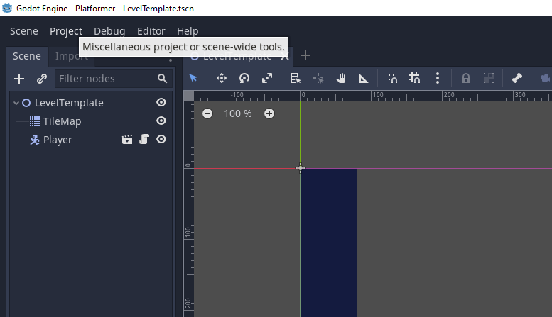
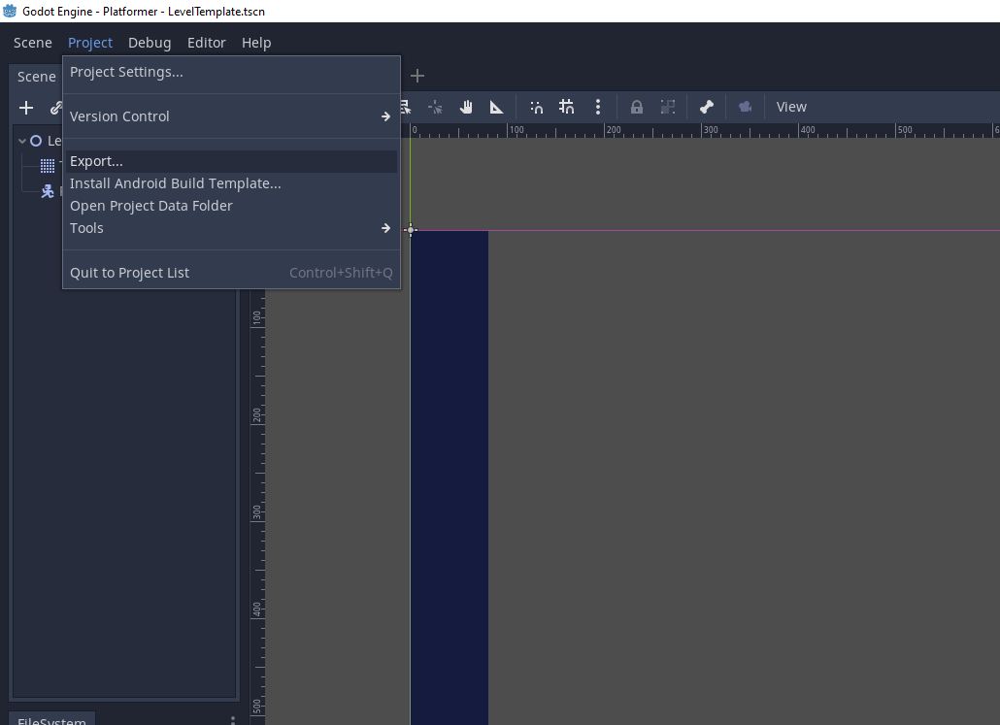
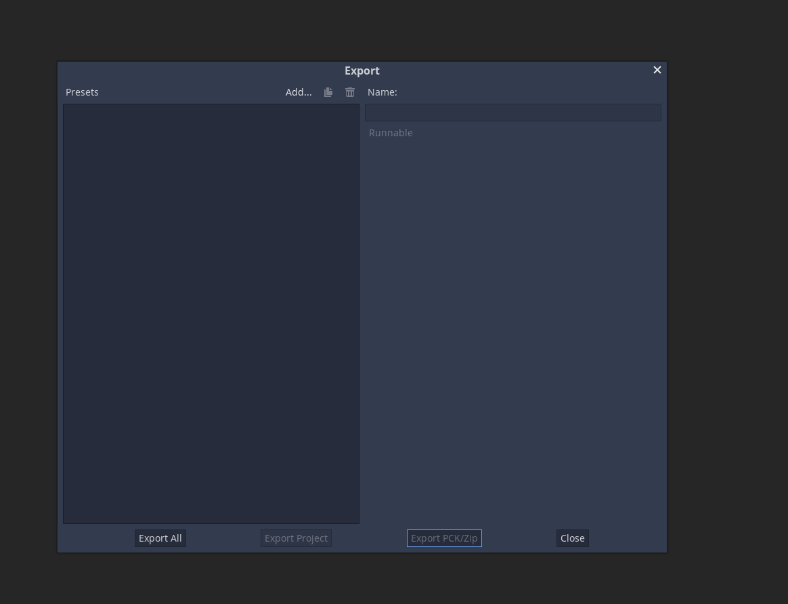
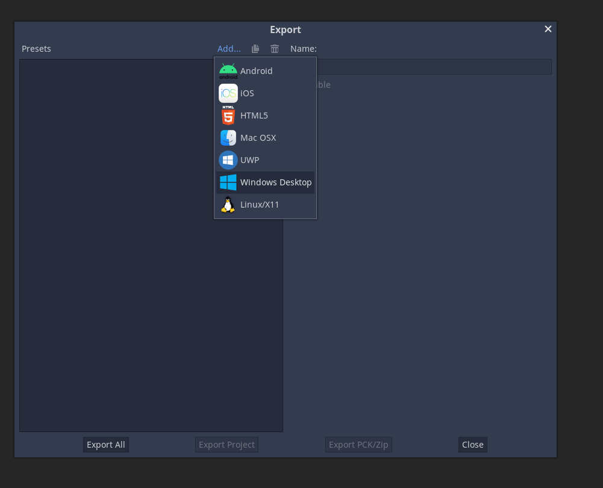
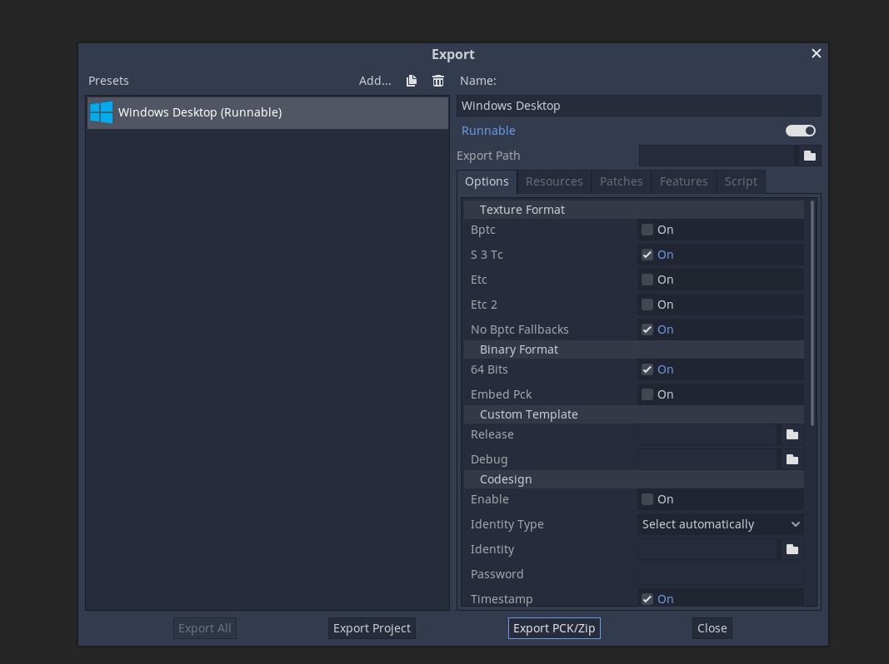
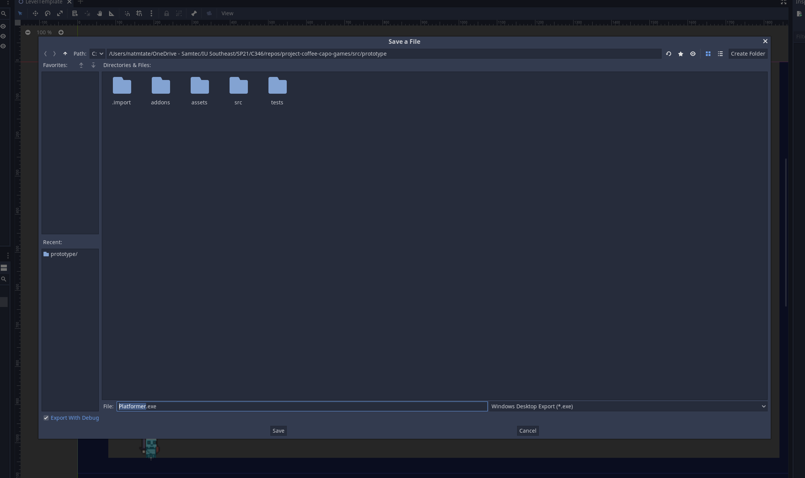

# Arachnivania

This project is a Godot-powered game using the native GDscript language. Art is created using Aseprite, TileSetter, and GIMP.

[1. Description](#desription)
[2. Controls](#controls)
[3. Build Info](#build-info)
[4. Authors](https://github.com/IUS-CS/project-coffee-capo-games/blob/main/AUTHORS.txt)
[5. License](https://github.com/IUS-CS/project-coffee-capo-games/blob/main/LICENSE.txt)
[6. Acknowledgements](#acknowledgements)

## Description

Arachnivania is a 2D Metroidvania. You play as Widower, a spider warrior trying to protect his burrow from the menacing Wasps. In the process you will discover new ways to fight and avoid enemies while trying to protect your family and burrow.

## Controls

* WASD - used for basic movement, A & D move left and right, respectively, while W is used to jump over obstacles and enemies.
* L-SHIFT - used for the unlockable dash attack, dash into ememies and climable walls
* CAPSLK - Toggle between bite and shoot vemon attack
* L-CLICK - bite/shoot venom
* R-CLICK - web shoot (functions as grappling hook), for getting over ledges and reach high ledges
* MOUSE CURSOR - aim vemon shoot and grappling hook
* E - Use dead bugs as a shield
* Q - Drop dead bugs as bait

## Build Info

To build the executable for the project, open the Godot Project in the Godot Engine, click "Project",

Click "Export" 

Click "Add" 

Select your preferred platform 

With Platform builder selected and installed, click "Export Project"

Name your executable and place in the directory that you want, and click "Save"

The executable file will now be saved in the directory that you chose

## Engine Info

Coded in Godot Engine's custom GD Scipt, later built in terminal using python and scons.
The levels are constructed using imported pixel art, with the Godot Engine's physics layers function calculating collision. All player and enemy movement is calculated using the physics functions in GD Script

