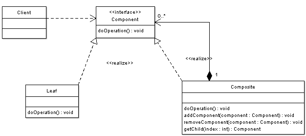
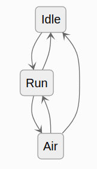
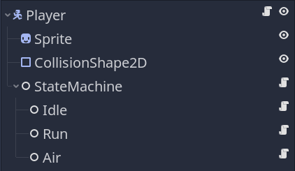

# Design Patterns

## Introduction

Godot's design philosphy is based on the Composite design pattern. https://www.oodesign.com/composite-pattern.html defines
the Composite Pattern as:

"There are times when a program needs to manipulate a tree data structure and it is necessary to treat both Branches as well 
as Leaf Nodes uniformly. Consider for example a program that manipulates a file system. A file system is a tree structure that 
contains Branches which are Folders as well as Leaf nodes which are Files. Note that a folder object usually contains 
one or more file or folder objects and thus is a complex object where a file is a simple object. Note also that since files and 
folders have many operations and attributes in common, such as moving and copying a file or a folder, listing file or folder 
attributes such as file name and size, it would be easier and more convenient to treat both file and folder objects uniformly 
by defining a File System Resource Interface."

<p align="center">
  
</p>

Another aspect of Godot's design is aggregation. This is the premise of the .tscn files. Each object will be an aggregate of assets
and codes, which then can be used to aggregate on other .tscn files.

## State Pattern

In order to better organize the code and allow for ease of expansion and consolidation, we have decided to implement a Finite State
Machine, or State Design. This will work nicely with the already used Composite Design (see implementation). 

<p align="center">
  
</p>

If we were to create just one class that would have all of the abilities and states combined, it would eventually become unmanageble.
This would also increase the chances of bugs. The goal of this pattern is to seperate every state into its own unique object. The state
machine is a class that keeps track of the current state and is responsible for state transition. The benefits to this is that each state
only access the properties it needs, behaviors can be easily reused without the need to duplicate code, debugging will be easier due
to easily identifible files and the state machine is a generic and reusable component that can be shared within the code base.

## implementation

First we will need to create the state class and the finite state machine.

### State Class

```GDScript
# Virtual base class for all states.
class_name State
extends Node

# Reference to the state machine, to call its `transition_to()` method directly.
# That's one unorthodox detail of our state implementation, as it adds a dependency between the
# state and the state machine objects, but we found it to be most efficient for our needs.
# The state machine node will set it.
var state_machine = null


# Virtual function. Receives events from the `_unhandled_input()` callback.
func handle_input(_event: InputEvent) -> void:
	pass


# Virtual function. Corresponds to the `_process()` callback.
func update(_delta: float) -> void:
	pass


# Virtual function. Corresponds to the `_physics_process()` callback.
func physics_update(_delta: float) -> void:
	pass


# Virtual function. Called by the state machine upon changing the active state. The `msg` parameter
# is a dictionary with arbitrary data the state can use to initialize itself.
func enter(_msg := {}) -> void:
	pass


# Virtual function. Called by the state machine before changing the active state. Use this function
# to clean up the state.
func exit() -> void:
	pass
```
### Finite State Machine

```GDScript
# Generic state machine. Initializes states and delegates engine callbacks
# (_physics_process, _unhandled_input) to the active state.
class_name StateMachine
extends Node

# Emitted when transitioning to a new state.
signal transitioned(state_name)

# Path to the initial active state. We export it to be able to pick the initial state in the inspector.
export var initial_state := NodePath()

# The current active state. At the start of the game, we get the `initial_state`.
onready var state: State = get_node(initial_state)


func _ready() -> void:
	yield(owner, "ready")
	# The state machine assigns itself to the State objects' state_machine property.
	for child in get_children():
		child.state_machine = self
	state.enter()


# The state machine subscribes to node callbacks and delegates them to the state objects.
func _unhandled_input(event: InputEvent) -> void:
	state.handle_input(event)


func _process(delta: float) -> void:
	state.update(delta)


func _physics_process(delta: float) -> void:
	state.physics_update(delta)


# This function calls the current state's exit() function, then changes the active state,
# and calls its enter function.
# It optionally takes a `msg` dictionary to pass to the next state's enter() function.
func transition_to(target_state_name: String, msg: Dictionary = {}) -> void:
	# Safety check, you could use an assert() here to report an error if the state name is incorrect.
	# We don't use an assert here to help with code reuse. If you reuse a state in different state machines
	# but you don't want them all, they won't be able to transition to states that aren't in the scene tree.
	if not has_node(target_state_name):
		return

	state.exit()
	state = get_node(target_state_name)
	state.enter(msg)
	emit_signal("transitioned", state.name)
```
Next the state pattern will need to be added to the .tscn files by attaching the state pattern script to the root node 
and finite state machine to a new node that will have the different states as children nodes.

<p align="center">
  
</p>

The code that defines the states behavior will then be attached to its corresponding node. This is where you can see how well
the State Pattern works alongside the Composite/aggregate Pattern.

### Sources
https://www.gdquest.com/tutorial/godot/design-patterns/finite-state-machine/
https://www.oodesign.com/composite-pattern.html
