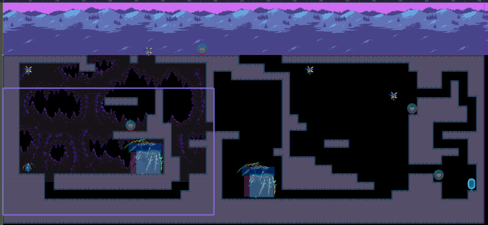

# Sprint Ceremony Minutes
  
Date: 03-04-21

Members present:

* Nathan Tate
* Ryan Goode
* Ryan Scott
  
## Demo
  
  This sprint, we completed:
  
* Added killable enemies into the level, of varying sizes and behavior
* Added health pickups for the player to receive in order to restore health
* Added early-stage level transitions for future use to progress through different levels
* Improved the walking animations for the player character sprite
* Added Canvas background to the level that follows player movement for better visuals
* Added new level background art that matches the color palette of the rest of the level 
  Here are screenshots of what we did:
  
  
  
### Good
  
* Added more gameplay elements to the first and second levels
* Create a procedure to edit Godot scene files, preventing future merge conflicts
* Restructured game files to better organize scripts, assets, and scenes
* Reduced the number of merge conflicts (sprint-wide)
  
### Bad
  
* Merge conflict at the beginning of the sprint hindered progress slightly
* Overestimated amount of work that team could accomplish in one sprint
* Time Management skills of the team still need improvement
  
### Actionable Commitments
  
* As a team, we will...
* As a team, we will create more issues in the project board on GitHub in more to better track progress of tasks, as well as hold every team member accountable to their objectives.
* As a team, we will prioritze the assignment portion of the sprint work.
*As a team, we will stay more informed on each other's objectives while working on our own, in an effort to reduce any merge conflicts.
  
## Planning
  
  Points | Story
  -------|--------
  9| As a user, I want a title screen that looks good and can assist me in accessing the different functions of the game.
  6| As a user, I want to be able to pause the game if I need to, in order to step away or stop playing for a short amount of time.
  4| As a user, I want game music that is enjoyable and further immerses me into the game's mood.
  6| As an administrator, I want a seamless consolidation of individual game components to ensure timely completion and reduce opportunities for error.
  6| As a user, I want an in-game HUD that gives me relevant in-game information.
