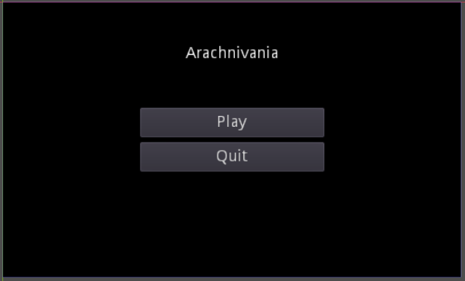
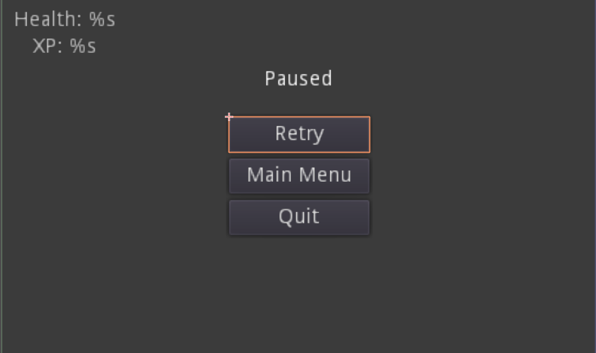

# Sprint Ceremony Minutes
  
Date: 2020-09-21

Members present:

* Nathan Tate
* Ryan Goode
* Ryan Scott
  
## Demo
  
This sprint, we completed:

* Title screen prototype
* Game audio
* Pause menu
* Player data representation in the UI
* Desgin Patterns document
  
Here are screenshots of what we did:
  

## Retro
  
[What is a Sprint Retrospective](https://www.scrum.org/resources/what-is-a-sprint-retrospective)
  
### Good
  
* The team is getting better and planning tasks and objectives and making use of the project board to better complete tasks
* No merge conflicts in sprint 3
* The team is learning how to effectively use the tools used to write the game code and create the game assets

### Bad
  
* Overlaps in planning caused bottlenecks in team members completing work, some team members were waiting on others in order to complete their tasks
* Map design workflow could use more structure in order to make the process of designing levels
  
### Actionable Commitments
  
* As a team, we will reduce task overlap in order to prevent members from needing to wait to on others to comeplete their tasks
* As a team, we will create better organized task items that fit the role of the teammates assigned
  
## Planning
  
Points | Story
-------|--------
3| As a user, I want a cool title screen that has a distint logo for the game
3| As a user, I want a clean UI that gives me player information to help me play the game and progress the level
4| As a administrator, I want to implement the cool button designs from the assets I created
2| As an administrator, I want to implement an end screen that appears in the screen beat the game or die, that allow you to quit or replay the game
4| As an administrator, I want to create and implement the finite state machine design
4| As an administrator, I want to refactor my code to conform with the finite state machine design
5| As an administrator, I want template levels that will act as the first few rooms after the title screen
5| As a administrator, I want a game world lays out the early concept of the in-game world overall