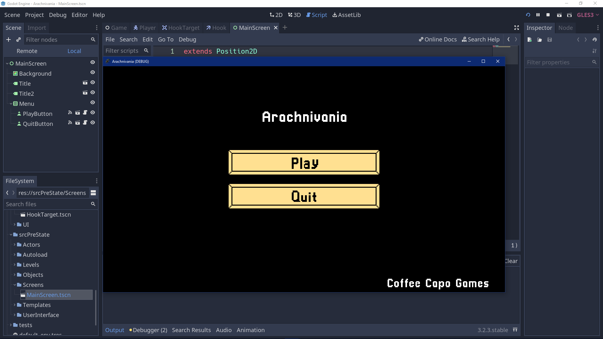
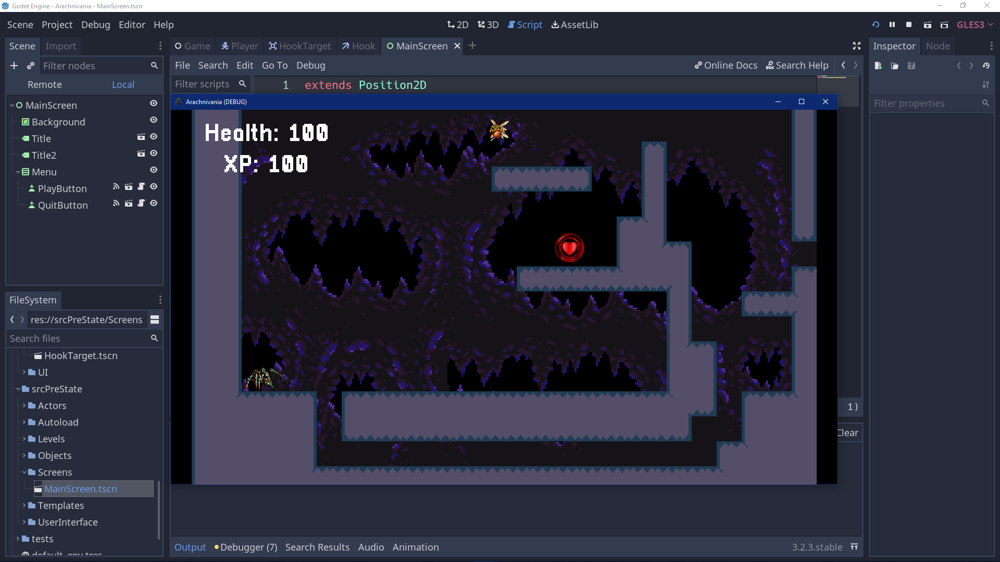
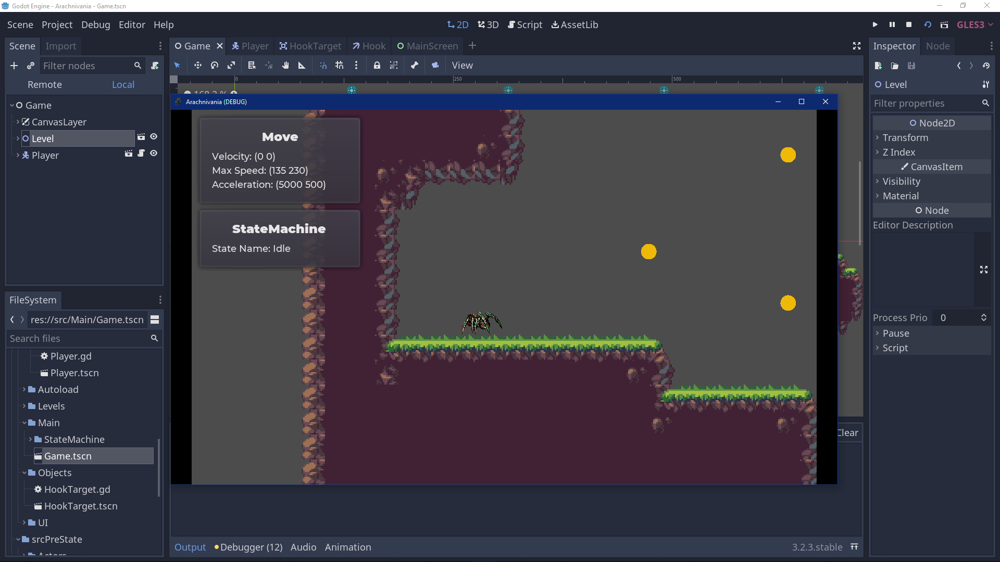

# Sprint Ceremony Minutes
  
Date: 2021-06-04

Members present:

* Nathan Tate
* Ryan Goode
* Ryan Scott
  
## Demo
  
This sprint, we completed:

* Completed the Game World concept
* Implemented the UI theme
* Added HUD assets
* Unit Test docs
* Refactored code to implement our State Machine
  
Here are screenshots of what we did:

## Retro
  
[What is a Sprint Retrospective](https://www.scrum.org/resources/what-is-a-sprint-retrospective)
  
### Good
  
* We were able to get alot done
* We had no overlap in individual work

### Bad
  
* We did not get everything done
  
### Actionable Commitments
  
* As a team, we will not plan more than what we can handle
  
## Planning
  
Points | Story
-------|--------
4| As a administrator, I want to implement a sprint and double jump
8| As a administrator, I want to implement a hooking element
6| As an administrator, I want to complete a projectreflections.md that has input from every group memeber
10| As an administrator, I want to have complete documentation on the game