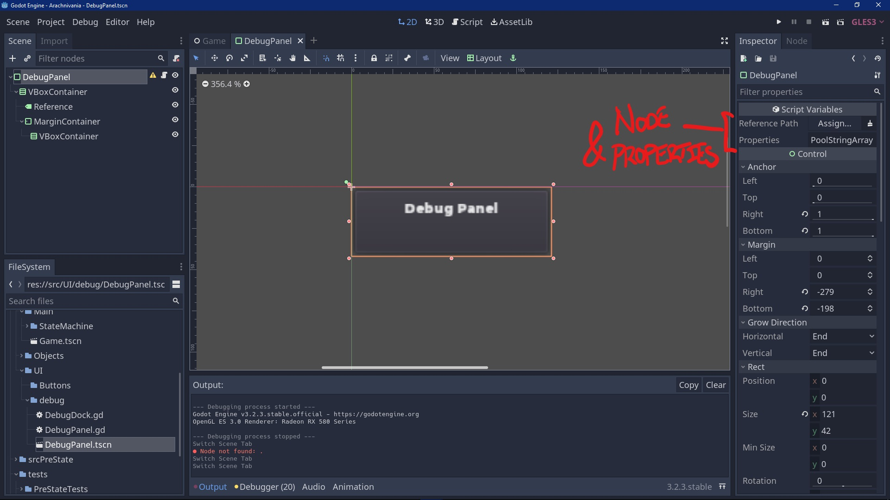
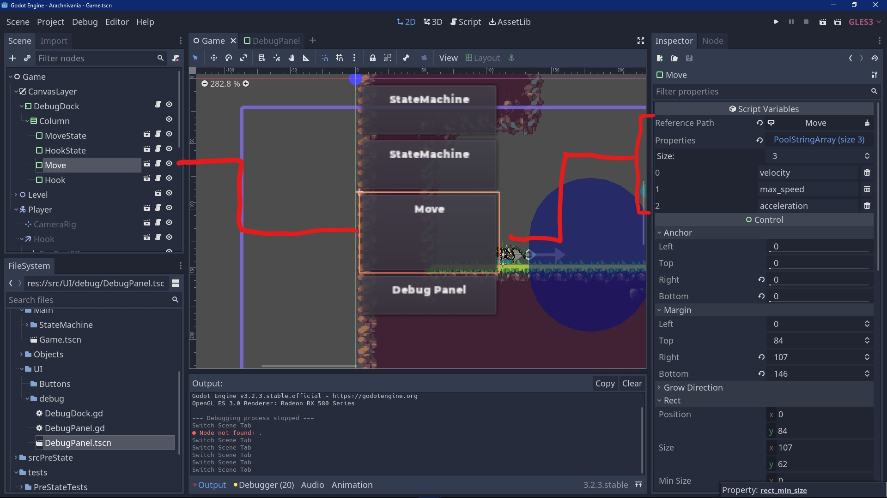
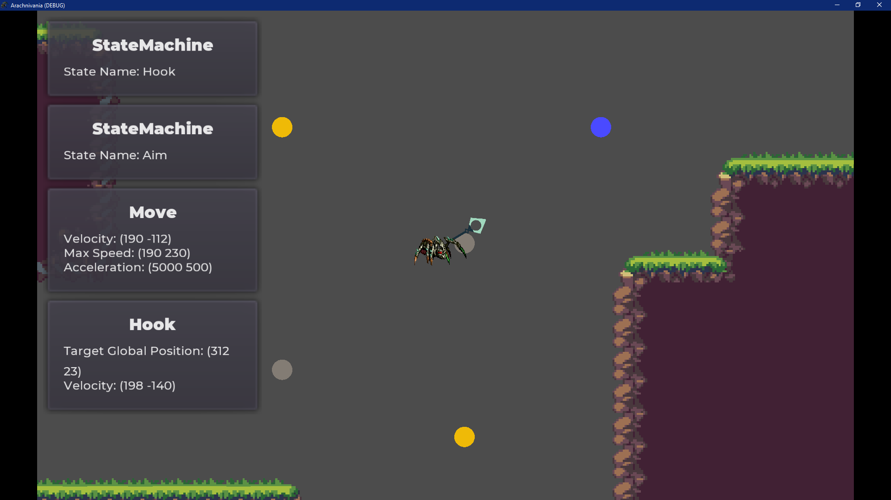
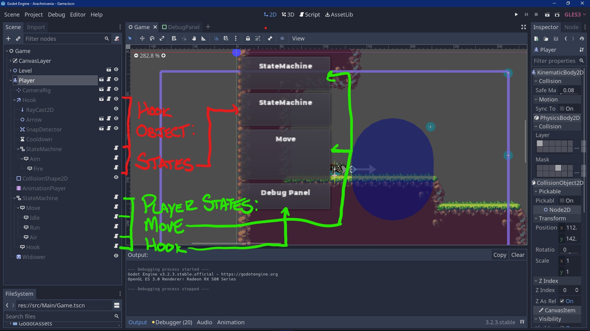

# Manual Unit Testing

Using the GUT library plugin for unit testing proved to be to difficult, as it was need to understand Godot, and what goes on under the hood, on a scall that was not suitable for us. Situations to test needed to be simulated in code using the multitude of build in Godot functions, and functions provided in the GUT library. GUT also was more focused on testing .gd files, instead of actual scene trees. The way that the State Machine was coded, was to refrence Node Paths, not Script Paths.

## Solution and Summary

It was decided the best corse of testing would be manually, using a debug panel that was added earlier in development. The purpose of this panel is to track, in real time, what state the player is in and any number of properties. The panel itself is modular and independant, meaning multiple instances of the panel can be added to the scene and track any Node in the scene. That panel can then track any multitude of properties. These can be already existing properties, or if there was specific propery within a function of that node, I could just add it outside the function as its own variable and then add that to the debug panel. I can do this in real time, even as I am demoing, so there is no need to close the demo and re-open, saving time.

## Method



This is the Debug Panel scene. This scene can be added to any scene and you can set the `Reference Path` to any node within that scene tree. In `Properties`, you can then set the number of variables you would like to track, and then put in the variable as it is named in the script



This is an example of what it may look like after it is added to the desired scene, here you can see the node in the scene tree, its visual representation on the screen and its configurable properties and where to set it up. 

## Results

This method of testing does not conform with Test Driven Development, as there is no way to set up the debug panel without actually developing the product. However, it is a quick and scalable method of testing for beginniners of game development within Godot.



Here you can see four different panels. The first panel is of type `StateMachine` and it is currently tracking the node `Player/StateMachine` that contains the child nodes of all the `Move` state. The property it is tracking is `_state_name`. This way I can monitor the move state it is in at all times during testing. Here is a section of the code relevant to the panel property it is tracking.

```GDscript
extends Node
class_name StateMachine, "res://GodotAssets/Icons/state_machine.svg"
"""
Generic State Machine. Initializes states and delgates engine callbacks
(_physics_process, _unhandled_input) to the active state.
"""

#allows the setting of an initial state from the inspector
export var initial_state: = NodePath()

#active state variable that starts as the initial state and uses a setter to change
onready var state: State = get_node(initial_state) setget set_state
#allows for printing of state name for debugging
onready var _state_name: = state.name
```
The next panel is the same as before, but instead it is checking the state of the `StateMachine` whose children states are for the `Hook` object, `Aim` and `Fire`. As it is the same `StateMachine` script, just with different dependancies.


The third panel tracks the three variables associated with `Move`and the child states `Idle`, `Run`, `Air`. These variables are the return value of the the functions that make up these move states.

The fourth panel is the same as the third, except instead of `Move` it tracks variables associated with the player as they are in the process of hooking.

## Conclusion



Here is a diagram from the example above. In the main game scene tree you can see with just these four panels we cover almost all the content that has code attached to it. We can easily add more `Node` objects with properties and conditions to test.